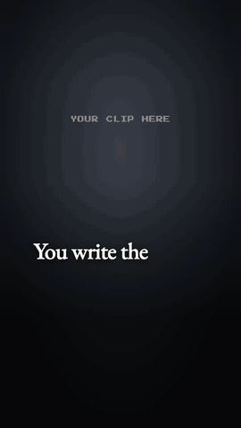

# paper-motion

A Claude Code skill that makes a reel without recording and without an editor. You write the script. A voice reads it. Claude writes the edit as code.



The reel opens on footage of you with a caption on every word, then slides down to a paper animation that explains the idea: notebook grid, words that land one at a time, dark cards, small mascots. Every animation is tied to a word of the voice, so nothing drifts out of sync.

Built and used by [@criscatalyst](https://instagram.com/criscatalyst).

## What's inside

| | |
|---|---|
| `SKILL.md` | The instructions Claude follows: script, voice, footage, visuals, sound, render, and the rules of the format. |
| `template/src/kit.tsx` | The building blocks: paper, headline text, footage with captions, cards, stickers, mascots, sound, voice cues. |
| `template/src/Example.tsx` | A 10 second reel to copy. It runs out of the box with a placeholder where your clip goes. |
| `scripts/words.py` | Turns a voice file into `words.json`, the timing of every spoken word. |

## You need

- [Claude Code](https://claude.com/claude-code)
- Node 18 or newer, and ffmpeg
- Whisper for the word timings: `pip install openai-whisper`
- A voice. [Voicebox](https://github.com/jamiepine/voicebox) is free, open source and clones your voice on your own machine. Any other voice file works, including a real recording.

## Install

```bash
git clone https://github.com/criscatalyst/paper-motion.git ~/.claude/skills/paper-motion
```

## Try the example

```bash
cp -R ~/.claude/skills/paper-motion/template ./paper-motion
cd paper-motion
npm install
npx remotion studio src/index.tsx
```

The example plays in your browser. It has no sound and shows "YOUR CLIP HERE": put a vertical clip in `public/`, write its name in `CLIP` at the top of `src/Example.tsx`, and it appears.

## Make your first reel

Open Claude Code in the folder you just created and say:

```
Make a Paper Motion reel from this script: <paste your script>
```

Claude asks for your voice file and your clips, shows you a storyboard, writes the reel, and renders a preview. You approve each step. The final render starts only when you say so.

## Make it yours

Colours and fonts are constants at the top of `template/src/kit.tsx`. Change `GOLD`, `PAPER`, `INK` and the four font loaders and the whole reel follows.

## Limits

- You judge the voice and the motion. Claude can check layout, timing and the safe area; it cannot hear.
- Whisper misspells names. The skill tells Claude to check, but read the transcript yourself the first time.
- Tested on macOS with Remotion 4.0.471.

## Licence

Code: MIT. Sounds in `template/public/sfx`: Kenney "Interface Sounds", CC0. Fonts load from Google Fonts under their open licences. Remotion has its own licence, free for individuals and small teams: read [remotion.dev/license](https://www.remotion.dev/license) before using it in a company.

Follow [@criscatalyst](https://instagram.com/criscatalyst) for daily AI systems to grow your business.
